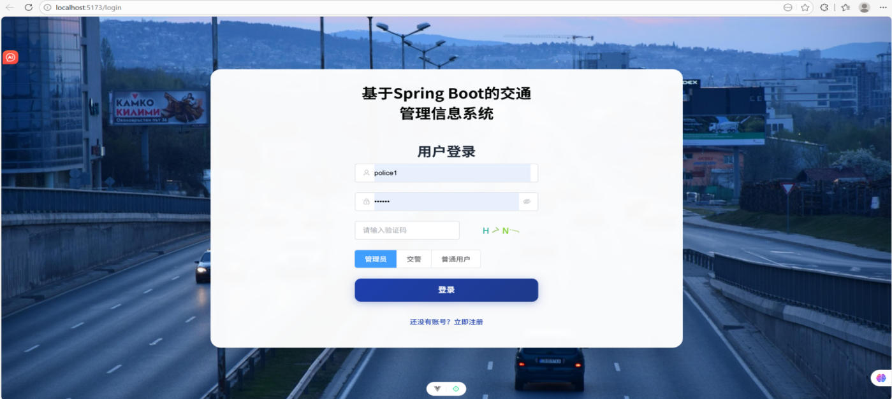
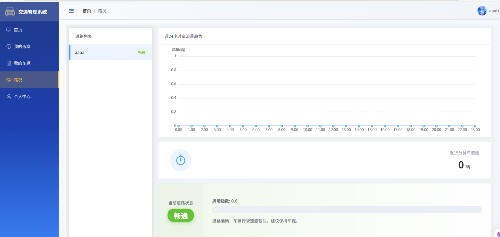
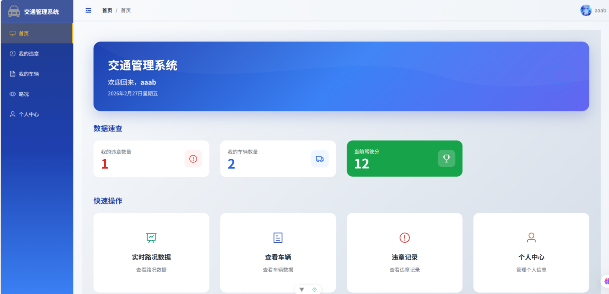
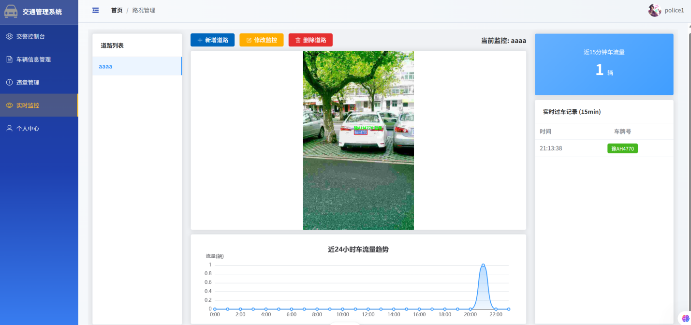

# 基于spring boot的交通管理系统

这是一个基于spring boot的交通管理系统，通过yolo v8车牌检测模型对车牌进行检测和识别，并且能够将识别到的车牌实时加入数据库
本项目使用的yolo v8模型来自：https://github.com/we0091234/Chinese\_license\_plate\_detection\_recognition

# 角色

本项目主要将角色分为三大类：

## 1.普通用户

能够快速便捷的查询个人名下车辆的详细信息，历史违章记录以及违章单的处理状态；能够
实时查看道路路况和交通流量信息；能够完成违章确认与罚款缴纳

## 2.交警

交警可以快速查询所有车辆信息，驾驶人信息以及历史违章数据，以辅助执法；需要对管辖
区域的交通流量数据进行监控与查看，并且能够记录经过其管辖区的车辆的车牌号

## 3.管理员

管理员负责管理所有系统用户账户，包括创建，禁用，权限分配；维护系统基础数据字典；监控系统运行状态，管理数据备份

# 模块

## 用户管理模块

注册与登录： 支持普通用户注册并登录（账号密码登录+JWT令牌返回）；交警与管理员账号由后台创建
权限控制： 基于RBAC的访问控制，不同角色登录后呈现不同的功能菜单与操作权限
个人信息维护： 用户可修改密码，头像等基本信息

## 车辆信息模块

车辆信息管理：提供对车辆信息的增加，删除，修改，查询功能
信息查询与统计：支持通过车牌号进行模糊查询

## 交通违章处理模块

违章信息录入： 交警可手动录入违章记录（选择车牌后自动带出车辆信息）
违章查询与处理: 车主可查询本人车辆的待处理与历史违章记录。系统提供在线违章确认，模拟缴费状态更新的完整流程

## 路况监控模块

视频监控：系统能够上传并播放道路视频。
车牌识别与记录： 系统能够自动识别经过车辆的车牌号，并记录近15分钟经过道路的车辆。
车流量统计： 系统能够自动统计并展示各路段近15分钟以及24小时的车流量趋势，生成可视化的折线图/。

# 预览

